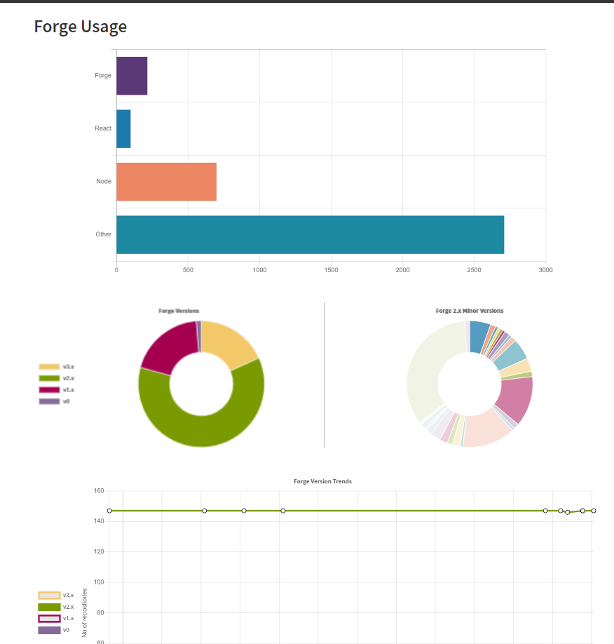

# forge-analytics
Forge is a design system which is used by designers and developers to create and utilize React Componets. To gain insight into the usage of Forge throughout the organization along with sharing this information, an analytics dashboard was needed which could be accessed by everyone in the organization.

Forge Analytics is a Full Stack Single Page Application which provides this data. It utilizes technologies such as Node.js, React.js and Express.js among a few. It provides visualizations using different kinds of charts and tables created using React-Chartjs-2 and Forge components. A trend graph allows us to depict the historical usage of Forge and the variation in it's utilization by teams in the organization. A Download Link is provided as well to export all of this data. All the data gets updated weekly using cron jobs created on AWS Lambda. The dashboard itself is deployed as a static website on an AWS S3 bucket.

## Analytics Dashboard

